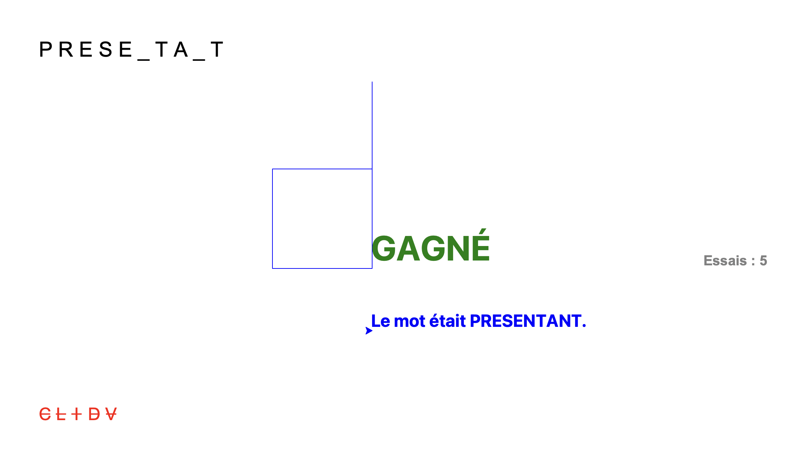
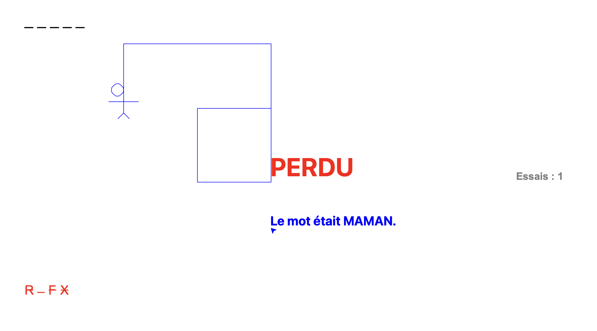

# Introduction
Projet réalisés durant les vacances de la Toussaint pour la spécialité NSI.
# Présentation des différents projets
> Les projets sont au nombre de 6.
<h2>4. Palindrome</h2>
<ul>
Selon la définition des principaux dictionnaires, un palindrome est un mot, un nombre ou une phrase « que l'on peut lire indifféremment de gauche à droite et de droite à gauche. » En d'autres termes, la succession des lettres ou des chiffres du palindrome est identique quand on la parcourt de gauche à droite ou de droite à gauche. Le palindrome est considéré comme une figure de style, et est apprécié de nombreux littérateurs ou de verbicrucistes. Mon script peut reconnaître les Palindromes.
</ul>
<h2>5. Jeu du pendu</h2>
Vous connaissez sans doute le jeu du pendu, les règles sont simples, il vous faudra deviner un mot et chaque erreur conduit à une étape de plus vers le suicide d'un bonhomme, si son suicide aboûtit vous perdez, si vous trouvez le mot avant cela il survrira. 
Plusieurs modes de jeu sont disponibles, en premier lieu : 
<li>Le mode aléatoire 
<li> Le mode choix 
Il y a trois niveaux de difficulté dans le mode aléatoire, facile pour les mots de 5 lettres, normal 10 lettres et difficile 15 lettres. Vous aurez droit à un nombre de tentatives égal à la longueur du mot. 
Pour ce qui est du mode choix, vous pourrez choisir un mot et demander à quelqu'un de le deviner, même chose pour le nombre de tentatives, il est égal au nombre de lettres.

<h2>6. Chiffrement de César</h2>
<ul>
  Lors de ses batailles, l'empereur romain JULES CÉSAR cryptait les messages qu'il envoyait à ses généraux. Sa méthode de codage consistait à décaler les lettres de 3 rangs, vers la droite, dans l'alphabet. Cette méthode de cryptage est appelée chiffrement de César, ou Code César. 
  <strong>Mon script</strong> peut chiffrer et déchiffrer le Code César. 
  Vous pouvez saisir le texte manuellement comme lui demander de traduire l'intégralité d'un fichier texte.
</ul>
